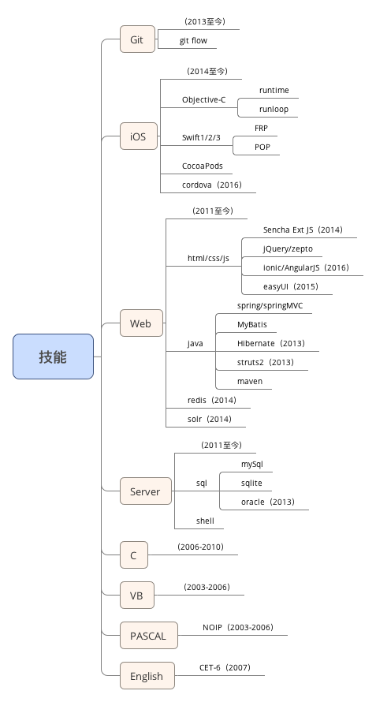

- 姓名：曹琪
- 性别：男
- 手机：**188-8896-9715**
- 邮箱：[archerchey@gmail.com](mailto:archerchey@gmail.com)
- 生日：1987年7月15日
- 籍贯：杭州
- Github：[**https://github.com/archerchey**](https://github.com/archerchey)
- CV：[**https://archerchey.github.io/cv/**](https://archerchey.github.io/cv/)

---

# 项目经历
## 酷帘B端（App & H5）
- 简介：酷糖视觉线下销售客户端，用于管理商品、订单、收入等数据
- 环境：AppCode/Xcode/WebStorm、cordova/ionic/AngularJS
- 负责：底层框架搭建，业务模块开发，cordova原生插件开发，接口对接

## 司珍房（App & Api）
##### iOS端
- 简介：为三峡国际珠宝博艺园提供珠宝垂直产业链提供平台
- 环境：AppCode/Xcode、Swift3、CocoaPods
- 负责：底层框架设计、搭建，业务模块开发，接口对接

##### api端
- 简介：为司珍房APP提供数据接口
- 环境：Idea、Java、SSB、maven、mySql
- 负责：框架搭建，接口编写，项目构建

## 健康网、健康网药店版（App & Api）
##### iOS端
- 简介：为山东葵源制药提供在线商城平台，及其线下门店运营及推广工具
- 环境：AppCode/Xcode、OC、CocoaPods
- 负责：底层框架设计、搭建，业务模块开发，接口对接，app发布，改版维护

##### api端
- 简介：为健康网APP、健康网药店版APP提供数据接口
- 环境：Idea、Java、SSB、maven、mySql
- 负责：框架搭建，接口编写，项目发布

## 药易方、药易方（Web & 后台）
- 简介：田橙网络名下在线B2B商城
- 环境：Idea、Java、HTML/CSS/JS、SSB、maven、mySql
- 负责：业务模块开发

## 小窝（App）
- 简介：为房产经纪人提供信息获取及交易平台
- 环境：AppCode/Xcode、OC、CocoaPods
- 负责：底层框架设计、搭建，业务模块开发，接口对接，app发布，改版维护

## 找房吧、找房吧经纪人版（App）
- 简介：提供在线房源信息展示平台，以及经纪人销售、推广工具
- 环境：AppCode/Xcode、OC、Swift1.0、CocoaPods
- 负责：底层框架设计、搭建，业务模块开发，接口对接，app发布，改版维护

## 享寓（App）
- 简介：提供空闲房源在线展示销售平台
- 环境：AppCode/Xcode、OC、CocoaPods
- 负责：底层框架设计、搭建，业务模块开发，接口对接，app发布，改版维护

## 构家网社区（Web & 后台）
- 简介：为家装行业商户、设计师及客户提供在线交流心得、经验、洽谈平台
- 环境：Idea、Java、HTML/CSS/JS、SSB、maven、mySql、solr、redis
- 负责：业务模块开发

## 构家网（H5）
- 简介：用于为一站式整包家装概念推广
- 环境：Idea、HTML5/CSS/JS、mySql
- 负责：业务模块开发

## 构家网商城（Web & 后台）
- 简介：为有家装需求客户提供在线一站式整包家装产品商城
- 环境：Idea、Java、HTML/CSS/JS、SSB、maven、mySql
- 负责：业务模块开发

---

---

# 工作经历
## 杭州田橙网络科技有限公司
- 时间：2016/3-2016/11
- 岗位：无线事业组负责人／开发工程师
- 描述：负责无线事业组日常事务管理，负责移动端开发工程师的招聘；负责项目管理、开发、发布，负责iOS架构设计、搭建与业务开发

## 北京小窝科技有限公司
- 时间：2015/5-2016/3
- 岗位：开发工程师
- 描述：负责移动端开发工程师的招聘，负责项目管理、开发、发布，负责iOS架构设计、搭建与业务开发

## 杭州构家网络科技有限公司
- 时间：2014/5-2015/4
- 岗位：开发工程师
- 描述：负责各项目开发、维护

## 上海汽轮机厂有限公司
- 时间：2010/8-2014/4
- 岗位：开发工程师
- 描述：物料供应平台开发、维护

---

# 教育经历
## 上海大学
- 时间：2006/9-2010/7
- 专业：材料科学与工程学院 - 冶金工程
- 发明专利：超声波作用对取向硅钢磁性能影响的研究

## 杭州市第十四中学
- 时间：2003/9-2006/7
- 特长：**数学**
- 信息学奥林匹克竞赛（2003-2006），编程生涯的开始