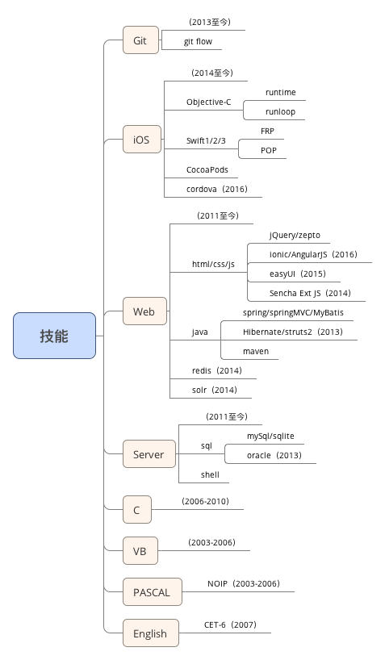

- 姓名：曹琪
- 手机：**188-8896-9715**
- 邮箱：[archerchey@gmail.com](mailto:archerchey@gmail.com)
- QQ／微信号：327030622
- 性别：男
- 生日：1987年7月15日
- Github：[**https://github.com/archerchey**](https://github.com/archerchey)
- CV：[**https://archerchey.github.io/cv/**](https://archerchey.github.io/cv/)

---

# 工作经历
## 杭州田橙网络科技有限公司
- 时间：2016/3-2016/11
- 岗位：无线事业组负责人／开发工程师

## 北京小窝科技有限公司
- 时间：2015/5-2016/3
- 岗位：开发工程师

## 杭州构家网络科技有限公司
- 时间：2014/5-2015/4
- 岗位：开发工程师

## 上海汽轮机厂有限公司
- 时间：2010/8-2014/4
- 岗位：开发工程师

---

---

# 主要项目
## 酷帘（iOS & H5）
- 环境：AppCode/Xcode/WebStorm、cordova/ionic/AngularJS
- 负责：底层框架搭建，业务模块开发，cordova原生插件开发，接口对接

## 司珍房（iOS）
- 环境：AppCode/Xcode、Swift3、CocoaPods
- 负责：底层框架设计、搭建，业务模块开发，接口对接

## 司珍房（API）
- 环境：Idea、Java、SSB、maven、mySql
- 负责：框架搭建，接口编写，项目构建

## 健康网、健康网药店版（iOS）
- 环境：AppCode/Xcode、OC、CocoaPods
- 负责：底层框架设计、搭建，业务模块开发，接口对接，app发布，改版维护

## 健康网、健康网药店版（API）
- 环境：Idea、Java、SSB、maven、mySql
- 负责：框架搭建，接口编写，项目发布

## 药易方（WEB & EM）
- 环境：Idea、Java、HTML/CSS/JS、SSB、maven、mySql
- 负责：业务模块开发

## 小窝（iOS）
- 环境：AppCode/Xcode、OC、CocoaPods
- 负责：底层框架设计、搭建，业务模块开发，接口对接，app发布，改版维护

## 找房吧、找房吧经纪人版（iOS）
- 环境：AppCode/Xcode、OC、Swift1.0、CocoaPods
- 负责：底层框架设计、搭建，业务模块开发，接口对接，app发布，改版维护

## 享寓（iOS）
- 环境：AppCode/Xcode、OC、CocoaPods
- 负责：底层框架设计、搭建，业务模块开发，接口对接，app发布，改版维护

## 构家网社区（WEB & EM）
- 环境：Idea、Java、HTML/CSS/JS、SSB、maven、mySql、solr、redis
- 负责：业务模块开发

## 构家网商城（WEB & EM & H5）
- 环境：Idea、Java、HTML/CSS/JS、SSB、maven、mySql
- 负责：业务模块开发

---

# 教育经历
## 上海大学
- 时间：2006/9-2010/7
- 专业：材料科学与工程学院 - 冶金工程
- 发明专利：超声波作用对取向硅钢磁性能影响的研究

## 杭州市第十四中学
- 时间：2003/9-2006/7
- 特长：**数学**
- 信息学奥林匹克竞赛（2003-2006），编程生涯的开始